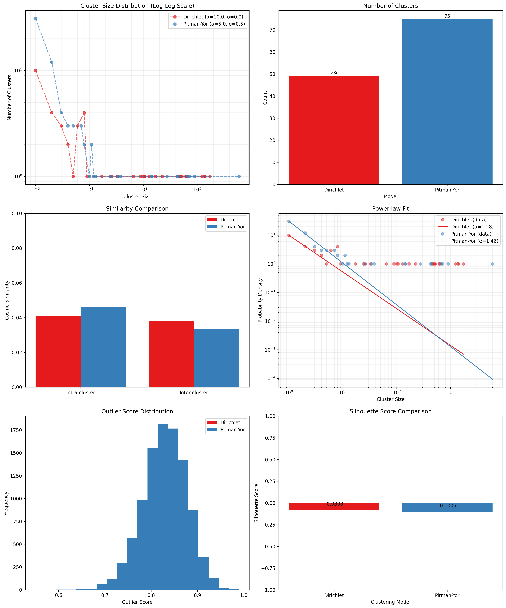

=====
Usage
=====

This document provides detailed instructions for using the ``clusx`` package.

Command Line Interface
======================

The ``clusx`` command-line tool provides a simple interface for clustering text data.

Basic Usage
-----------

.. code-block:: bash

   clusx cluster --input your_data.txt --output clusters.csv

Command Structure
-----------------

The ``clusx`` tool uses a command-based structure:

.. code-block:: bash

   clusx [global-options] COMMAND [command-options]

Available commands:

* ``cluster``: Cluster text data using Dirichlet Process and Pitman-Yor Process
* ``evaluate``: Evaluate clustering results using established metrics

Command Line Options for ``cluster``
------------------------------------

.. list-table::
   :header-rows: 1
   :widths: 20 50 30

   * - Option
     - Description
     - Default
   * - ``--input``
     - Path to input file (text or CSV) (required)
     -
   * - ``--column``
     - Column name to use for clustering (required for CSV files)
     - None
   * - ``--output``
     - CSV file with clustering results
     - ``clusters_output.csv``
   * - ``--output-dir``
     - Directory to save output files
     - ``output``
   * - ``--alpha``
     - Concentration parameter for clustering
     - 5.0
   * - ``--sigma``
     - Discount parameter for Pitman-Yor Process
     - 0.5

Command Line Options for ``evaluate``
-------------------------------------

.. list-table::
   :header-rows: 1
   :widths: 20 50 30

   * - Option
     - Description
     - Default
   * - ``--input``
     - Path to input file (text or CSV) (required)
     -
   * - ``--column``
     - Column name to use for clustering (required for CSV files)
     - None
   * - ``--dp-clusters``
     - Path to Dirichlet Process clustering results CSV (required)
     -
   * - ``--pyp-clusters``
     - Path to Pitman-Yor Process clustering results CSV (required)
     -
   * - ``--plot``
     - Generate evaluation plots
     - True
   * - ``--output-dir``
     - Directory to save output files
     - ``output``

Examples
========

Basic Clustering with Text File
-------------------------------

.. code-block:: bash

   clusx cluster \
      --input your_data.txt \
      --output clusters.csv

Clustering with CSV File
-----------------------

When using a CSV file, you must specify the column name to use for clustering:

.. code-block:: bash

   clusx cluster \
      --input your_data.csv \
      --column text_column \
      --output clusters.csv

Adjusting Clustering Parameters
-------------------------------

Fine-tune the clustering by adjusting the alpha and sigma parameters:

.. code-block:: bash

   clusx cluster \
      --input your_data.txt \
      --alpha 0.5 \
      --sigma 0.3

Specifying Output Directory
---------------------------

To save all output files to a specific directory, use the ``--output-dir`` option:

.. code-block:: bash

   clusx cluster \
      --input your_data.txt \
      --output-dir results

Understanding Output Files
--------------------------

The clustering process generates several output files that contain the clustering results:

**Clustering Output Files**

* ``*_dp.csv``: CSV file with Dirichlet Process clustering results
* ``*_pyp.csv``: CSV file with Pitman-Yor Process clustering results
* ``*_dp.json``: JSON file with Dirichlet Process clustering results
* ``*_pyp.json``: JSON file with Pitman-Yor Process clustering results

**JSON Output Format**

The JSON output follows this structure:

.. code-block:: json

   {
     "clusters": [
       {
         "id": 1,
         "representative": "What is the capital of France?",
         "members": [
           "What is the capital of France?",
           "What city is the capital of France?"
         ]
       }
     ],
     "metadata": {
       "model_name": "DP",
       "alpha": 1.0,
       "sigma": 0.0,
       "variance": 0.1
     }
   }

Each cluster contains:

* A unique ID
* A representative text (typically the first item in the cluster)
* A list of member texts that belong to the cluster
* Metadata with clustering parameters

**Example CSV Output**

The CSV output format provides a simple tabular view of cluster assignments:

.. code-block:: text

   Text,Cluster_DP,Alpha,Sigma,Variance
   "What is the capital of France?",0,1.0,0.0,0.1
   "What city is the capital of France?",0,1.0,0.0,0.1
   "How tall is the Eiffel Tower?",1,1.0,0.0,0.1
   "What is the height of the Eiffel Tower?",1,1.0,0.0,0.1

Evaluating Clustering Results
-----------------------------

After performing clustering, you can assess the quality and characteristics of
the generated clusters using the ``evaluate`` command:

.. code-block:: bash

   clusx evaluate \
      --input your_data.txt \
      --dp-clusters output/clusters_output_dp.csv \
      --pyp-clusters output/clusters_output_pyp.csv

For CSV files, remember to specify the column:

.. code-block:: bash

   clusx evaluate \
      --input your_data.csv \
      --column text_column \
      --dp-clusters output/clusters_output_dp.csv \
      --pyp-clusters output/clusters_output_pyp.csv

This command analyzes both Dirichlet Process and Pitman-Yor Process clustering
results, generating comprehensive metrics and visualizations to help you understand
cluster quality.

**Visualization Dashboard**

By default, the evaluation process generates an interactive visualization dashboard
(enabled with ``--plot``) that includes:

1. **Cluster Size Distribution**: Log-log scale plot showing the frequency of different cluster sizes
2. **Cluster Count Comparison**: Bar chart comparing the number of clusters generated by each method
3. **Similarity Analysis**: Comparison of intra-cluster vs. inter-cluster similarity metrics
4. **Power-law Fit**: Visualization using Clauset's method to determine if cluster sizes follow a power-law distribution
5. **Outlier Detection**: Identification of potential outliers in the clustering results
6. **Silhouette Score**: Comparative analysis of clustering quality using silhouette coefficients

The dashboard is displayed interactively and automatically saved as
``evaluation_dashboard.png`` in your specified output directory:

**Disabling Visualizations**

If you prefer to generate only the evaluation metrics without visualizations,
use the ``--no-plot`` option:

.. code-block:: bash

   clusx evaluate \
      --input your_data.txt \
      --dp-clusters output/clusters_output_dp.csv \
      --pyp-clusters output/clusters_output_pyp.csv \
      --no-plot

**Understanding Evaluation Results**

The evaluation results help you determine:

* Which clustering method (Dirichlet Process or Pitman-Yor Process) performs better for your data
* Whether your clusters exhibit natural power-law characteristics (common in many text datasets)
* The overall quality of separation between different clusters
* Potential improvements by adjusting clustering parameters

All evaluation metrics are saved in a structured JSON file (``evaluation_report.json``)
for further analysis or integration with other tools. Example evaluation report
(excerpt from ``evaluation_report.json``):

.. code-block:: json

   {
     "Dirichlet": {
       "model_name": "Dirichlet",
       "parameters": {
         "alpha": 1.0,
         "sigma": 0.0,
         "variance": 0.1,
         "random_state": 42
       },
       "cluster_stats": {
         "num_clusters": 481,
         "num_texts": 6936,
         "cluster_sizes": {   },
         "metrics": {
           "silhouette_score": 0.0,
           "similarity": {
             "intra_cluster_similarity": 0.18722277879714966,
             "inter_cluster_similarity": 0.18465441465377808,
             "silhouette_like_score": 0.002568364143371582
           },
           "powerlaw": {
             "alpha": 1.5285000160194153,
             "xmin": 3.0,
             "is_powerlaw": true,
             "sigma_error": 0.06658474334671548,
             "p_value": 1.2813607153252966e-05
           },
           "outliers": {   }
         }
       }
     },
     "Pitman-Yor": {
       "model_name": "Pitman-Yor",
       "parameters": {
         "alpha": 1.0,
         "sigma": 0.5,
         "variance": 0.1,
         "random_state": 42
       },
       "cluster_stats": {
         "num_clusters": 6921,
         "num_texts": 6936,
         "cluster_sizes": {   }
       },
       "metrics": {
         "silhouette_score": 0.0,
         "similarity": {
           "intra_cluster_similarity": 0.6593601107597351,
           "inter_cluster_similarity": 0.183600515127182,
           "silhouette_like_score": 0.4757595956325531
         },
         "powerlaw": {
           "alpha": 4.158122129400297,
           "xmin": 2.0,
           "is_powerlaw": false,
           "sigma_error": 0.8440436424146337,
           "p_value": 0.11200832634274878
         },
         "outliers": {   }
       }
     }
   }

``cluster_sizes`` and ``outliers`` are empty in the example above in sake of
brevity. In real-world datasets, they will contain the actual cluster sizes and
outliers.

**Understanding Clustering Parameters**

To interpret evaluation results and improve clustering performance, it's important to understand the key parameters:

1. **Clustering Parameters** (inputs to the clustering algorithms):

   * **alpha**: Concentration parameter that controls how likely the algorithm is to create new clusters.
     * Higher values (e.g., 5.0) create more clusters
     * Lower values (e.g., 0.1) create fewer, larger clusters
     * Range: Typically 0.1 to 10.0
     * Default: 5.0

   * **sigma**: Discount parameter used only in the Pitman-Yor Process.
     * Controls the power-law behavior of the cluster sizes
     * When sigma=0, the Pitman-Yor Process behaves like the Dirichlet Process
     * As sigma increases toward 1, the cluster size distribution becomes more power-law-like
     * Range: 0.0 to 0.9 (must be less than 1)
     * Default: 0.5

2. **Power Law Parameters** (detected in the evaluation results):

   * **alpha**: Power law exponent that describes how quickly the probability of finding larger clusters decreases.
     * Values around 2.0 indicate a strong power-law behavior in the cluster sizes
     * The higher this value, the more rapidly the frequency of large clusters decreases
     * Typical values in natural phenomena: 2.0 to 3.0
     * Note: This is different from the clustering alpha parameter

   * **sigma_error**: Standard error of the power law alpha estimate.
     * Smaller values indicate more confidence in the power law alpha estimate
     * Helps determine the reliability of the power law fit

**Optimizing Clustering Parameters**

Based on evaluation results, you can adjust parameters to improve clustering quality:

1. Start with the defaults (alpha=5.0, sigma=0.5)
2. If you want more clusters, increase alpha
3. If you want fewer clusters, decrease alpha
4. To get a more power-law-like distribution, increase sigma (for PYP only)
5. Evaluate the results using the evaluation metrics, especially silhouette score

The evaluation dashboard helps you compare different parameter settings and choose the optimal
configuration for your dataset. Higher silhouette scores indicate better-defined clusters, while
power-law characteristics often suggest natural language patterns in your data.

Python API
==========

You can also use the clustering functionality directly in your Python code.

Basic Usage
-----------

.. code-block:: python

   from clusx.clustering import DirichletProcess, PitmanYorProcess
   from clusx.clustering.utils import load_data, save_clusters_to_json

   # Load data from a text file
   texts = load_data("your_data.txt")

   # Or load data from a CSV file
   # texts = load_data("your_data.csv", column="text_column")

   # Perform Dirichlet Process clustering
   dp = DirichletProcess(alpha=1.0)
   clusters, _ = dp.fit(texts)

   # Save results
   save_clusters_to_json("clusters.json", texts, clusters, "DP")

Using Pitman-Yor Process
------------------------

The Pitman-Yor Process often produces better clustering results for text data:

.. code-block:: python

   # Perform Pitman-Yor Process clustering
   pyp = PitmanYorProcess(alpha=1.0, sigma=0.5)
   clusters_pyp, _ = pyp.fit(texts)

   # Save results
   save_clusters_to_json("pyp_clusters.json", texts, clusters_pyp, "PYP")

Evaluating Clusters
-------------------

You can evaluate the quality of your clusters using the evaluation module:

.. code-block:: python

   from clusx.evaluation import ClusterEvaluator, save_evaluation_report
   from clusx.visualization import visualize_evaluation_dashboard
   import numpy as np

   # Get embeddings for evaluation
   embeddings = np.array([dp.get_embedding(text).cpu().numpy() for text in texts])

   # Evaluate DP clusters
   dp_evaluator = ClusterEvaluator(texts, embeddings, clusters, "DirichletProcess")
   dp_report = dp_evaluator.generate_report()

   # Check if clusters follow power-law distribution
   powerlaw_params = dp_report["powerlaw_params"]
   if powerlaw_params["is_powerlaw"]:
       print(f"DP clusters follow power-law with alpha={powerlaw_params['alpha']:.2f}")
   else:
       print("DP clusters do not follow power-law distribution")

   # Evaluate PYP clusters
   pyp_evaluator = ClusterEvaluator(texts, embeddings, clusters_pyp, "PitmanYorProcess")
   pyp_report = pyp_evaluator.generate_report()

   # Compare results
   reports = {
       "DirichletProcess": dp_report,
       "PitmanYorProcess": pyp_report,
   }
   save_evaluation_report(reports, "output")

   # Generate visualization dashboard
   visualize_evaluation_dashboard(reports, "output", show_plot=True)

Customizing the Clustering Process
----------------------------------

You can customize various aspects of the clustering process:

.. code-block:: python

   # Custom alpha and sigma values
   dp = DirichletProcess(alpha=0.5)
   pyp = PitmanYorProcess(alpha=0.5, sigma=0.3)

   # Custom embedding model (advanced)
   from sentence_transformers import SentenceTransformer
   custom_model = SentenceTransformer("all-mpnet-base-v2")  # Different model

   # Custom similarity function (advanced)
   def custom_similarity(text, cluster_param):
       # Your custom similarity logic here
       pass

Performance Considerations
==========================

* **Memory Usage**: Large datasets may require significant memory, especially for the embedding model.
* **Processing Time**: The clustering process can be time-consuming for large datasets. The Pitman-Yor Process is typically faster than the Dirichlet Process.

Troubleshooting
===============

If you encounter issues:

1. Check your input file format
2. For CSV files, ensure you specify the correct column name with ``--column``
3. Ensure you have sufficient memory for large datasets
4. Try adjusting the alpha and sigma parameters for better clustering results
5. Remember to use the correct command structure: ``clusx cluster [options]`` instead of just ``clusx [options]``

**Limitations with Small Datasets**

When working with very small datasets (fewer than 10 texts) or when each text is placed in its own cluster, you may encounter visualization errors during evaluation. This is because:

* Power-law analysis requires a minimum number of data points to be meaningful
* Silhouette scores cannot be calculated when clusters have fewer than 2 samples
* Some statistical measures become unstable with very small sample sizes

In these cases:

* The evaluation will still complete and save the JSON report
* Some visualizations may show error messages instead of plots
* You can still analyze the clustering results through the CSV and JSON output files

For best results, use datasets with at least 20-30 texts to ensure meaningful clustering and evaluation.
