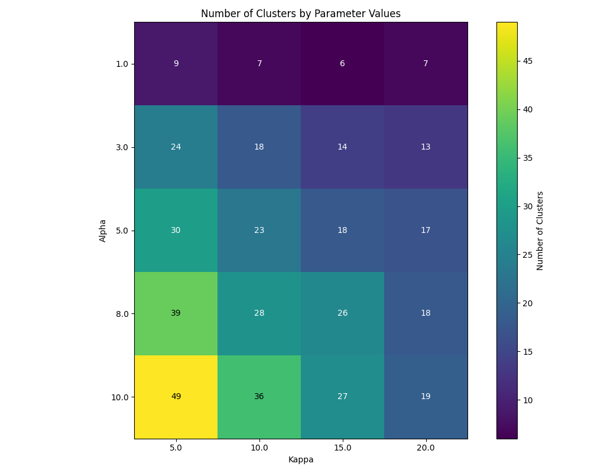

=====
Usage
=====

This document provides detailed instructions for using the ``clusx`` package.

Command Line Interface
======================

The ``clusx`` command-line tool provides a simple interface for clustering text data.

Basic Usage
-----------

.. code-block:: bash

   clusx cluster --input your_data.txt --output clusters.csv

Command Structure
-----------------

The ``clusx`` tool uses a command-based structure:

.. code-block:: bash

   clusx [global-options] COMMAND [command-options]

Available commands:

* ``cluster``: Cluster text data using Dirichlet Process and Pitman-Yor Process
* ``evaluate``: Evaluate clustering results using established metrics

Command Line Options for ``cluster``
------------------------------------

.. list-table::
   :header-rows: 1
   :widths: 30 50 20

   * - Option
     - Description
     - Default
   * - ``--input``
     - Path to input file (text or CSV) (required)
     -
   * - ``--column``
     - Column name to use for clustering (required for CSV files)
     - None
   * - ``--output``
     - CSV file with clustering results
     - ``clusters_output.csv``
   * - ``--output-dir``
     - Directory to save output files
     - ``output``
   * - ``--dp-alpha``
     - Concentration parameter for Dirichlet Process
     - 0.5
   * - ``--dp-kappa``
     - Precision parameter for Dirichlet Process likelihood model
     - 0.3
   * - ``--pyp-alpha``
     - Concentration parameter for Pitman-Yor Process
     - 0.3
   * - ``--pyp-kappa``
     - Precision parameter for Pitman-Yor Process likelihood model
     - 0.3
   * - ``--pyp-sigma``
     - Discount parameter for Pitman-Yor Process (0.0 ≤ σ < 1.0)
     - 0.3
   * - ``--random-seed``
     - Random seed for reproducible clustering
     - None

For detailed information about clustering parameters and recommended values for different models, see the `Understanding Clustering Parameters`_ section.

Command Line Options for ``evaluate``
-------------------------------------

.. list-table::
   :header-rows: 1
   :widths: 30 50 20

   * - Option
     - Description
     - Default
   * - ``--input``
     - Path to input file (text or CSV) (required)
     -
   * - ``--column``
     - Column name to use for clustering (required for CSV files)
     - None
   * - ``--dp-clusters``
     - Path to Dirichlet Process clustering results CSV (required)
     -
   * - ``--pyp-clusters``
     - Path to Pitman-Yor Process clustering results CSV (required)
     -
   * - ``--plot``
     - Generate evaluation plots
     - True
   * - ``--show-plot``
     - Display plots interactively (not recommended for automated runs)
     - False
   * - ``--output-dir``
     - Directory to save output files
     - ``output``
   * - ``--random-seed``
     - Random seed for reproducible evaluation
     - None

Examples
========

Basic Clustering with Text File
-------------------------------

.. code-block:: bash

   clusx cluster \
      --input your_data.txt \
      --output clusters.csv

Clustering with CSV File
------------------------

When using a CSV file, you must specify the column name to use for clustering:

.. code-block:: bash

   clusx cluster \
      --input your_data.csv \
      --column text_column \
      --output clusters.csv

Adjusting Clustering Parameters
-------------------------------

Fine-tune the clustering by adjusting the model-specific parameters. Here's an example using parameters that worked well for a dataset of ~7,000 sentences:

.. code-block:: bash

   clusx cluster \
      --input your_data.txt \
      --dp-alpha 15.0 \
      --dp-kappa 25.0 \
      --pyp-alpha 12.0 \
      --pyp-kappa 25.0 \
      --pyp-sigma 0.5 \
      --random-seed 42

The choice of parameters significantly affects clustering results. General guidelines include:

* Alpha values should be scaled based on your dataset size (higher for larger datasets)
* Higher kappa values make the model more sensitive to small differences between texts
* For Pitman-Yor Process, sigma controls the power-law behavior of cluster sizes
* Using the same alpha value for both DP and PYP leads to dramatically different clustering behaviors

For detailed guidance on parameter selection for each model, see the `Understanding Clustering Parameters`_ section below.

Specifying Output Directory
---------------------------

To save all output files to a specific directory, use the ``--output-dir`` option:

.. code-block:: bash

   clusx cluster \
      --input your_data.txt \
      --output-dir results

Understanding Output Files
--------------------------

The clustering process generates several output files that contain the clustering results:

**Clustering Output Files**

* ``*_dp.csv``: CSV file with Dirichlet Process clustering results
* ``*_pyp.csv``: CSV file with Pitman-Yor Process clustering results
* ``*_dp.json``: JSON file with Dirichlet Process clustering results
* ``*_pyp.json``: JSON file with Pitman-Yor Process clustering results

**JSON Output Format**

The JSON output follows this structure:

.. code-block:: json

   {
     "clusters": [
       {
         "id": 1,
         "representative": "What is the capital of France?",
         "members": [
           "What is the capital of France?",
           "What city is the capital of France?"
         ]
       }
     ],
     "metadata": {
       "model_name": "DP",
       "alpha": 1.0,
       "sigma": 0.0,
       "kappa": 0.3
     }
   }

Each cluster contains:

* A unique ID
* A representative text (typically the first item in the cluster)
* A list of member texts that belong to the cluster
* Metadata with clustering parameters

**Example CSV Output**

The CSV output format provides a simple tabular view of cluster assignments:

.. code-block:: text

   Text,Cluster_DP,Alpha,Sigma,Kappa
   "What is the capital of France?",0,1.0,0.0,0.3
   "What city is the capital of France?",0,1.0,0.0,0.3
   "How tall is the Eiffel Tower?",1,1.0,0.0,0.3
   "What is the height of the Eiffel Tower?",1,1.0,0.0,0.3

Evaluating Clustering Results
-----------------------------

After performing clustering, you can assess the quality and characteristics of
the generated clusters using the ``evaluate`` command:

.. code-block:: bash

   clusx evaluate \
      --input your_data.txt \
      --dp-clusters output/clusters_output_dp.csv \
      --pyp-clusters output/clusters_output_pyp.csv

For CSV files, remember to specify the column:

.. code-block:: bash

   clusx evaluate \
      --input your_data.csv \
      --column text_column \
      --dp-clusters output/clusters_output_dp.csv \
      --pyp-clusters output/clusters_output_pyp.csv

This command analyzes both Dirichlet Process and Pitman-Yor Process clustering
results, generating comprehensive metrics and visualizations to help you understand
cluster quality.

Visualization Dashboard
^^^^^^^^^^^^^^^^^^^^^^^

By default, the evaluation process generates an visualization dashboard
(enabled with ``--plot``) that includes:

1. **Cluster Size Distribution**: Log-log scale plot showing the frequency of different cluster sizes
2. **Cluster Count Comparison**: Bar chart comparing the number of clusters generated by each method
3. **Similarity Analysis**: Comparison of intra-cluster vs. inter-cluster similarity metrics
4. **Power-law Fit**: Visualization using Clauset's method to determine if cluster sizes follow a power-law distribution
5. **Outlier Detection**: Identification of potential outliers in the clustering results
6. **Silhouette Score**: Comparative analysis of clustering quality using silhouette coefficients

The dashboard is automatically saved as ``evaluation_dashboard.png`` in your specified output directory.
By default, plots are not displayed interactively to support automation and headless environments.
If you want to view plots interactively, use the ``--show-plot`` option:

.. code-block:: bash

   clusx evaluate \
      --input your_data.txt \
      --dp-clusters output/clusters_output_dp.csv \
      --pyp-clusters output/clusters_output_pyp.csv \
      --show-plot

.. image:: _static/evaluation_dashboard_v1.png
   :alt: Evaluation Dashboard Example
   :width: 100%

Disabling Visualizations
^^^^^^^^^^^^^^^^^^^^^^^^

If you prefer to generate only the evaluation metrics without visualizations,
use the ``--no-plot`` option:

.. code-block:: bash

   clusx evaluate \
      --input your_data.txt \
      --dp-clusters output/clusters_output_dp.csv \
      --pyp-clusters output/clusters_output_pyp.csv \
      --no-plot

Understanding Evaluation Results
^^^^^^^^^^^^^^^^^^^^^^^^^^^^^^^^

The evaluation results help you determine:

* Which clustering method (Dirichlet Process or Pitman-Yor Process) performs better for your data
* Whether your clusters exhibit natural power-law characteristics (common in many text datasets)
* The overall quality of separation between different clusters
* Potential improvements by adjusting clustering parameters

All evaluation metrics are saved in a structured JSON file (``evaluation_report.json``)
for further analysis or integration with other tools. Example evaluation report
(excerpt from ``evaluation_report.json``):

.. code-block:: json

   {
     "Dirichlet": {
       "model_name": "Dirichlet",
       "parameters": {
         "alpha": 1.0,
         "sigma": 0.0,
         "kappa": 0.3,
         "random_state": 42
       },
       "cluster_stats": {
         "num_clusters": 481,
         "num_texts": 6936,
         "cluster_sizes": {   },
         "metrics": {
           "silhouette_score": 0.0,
           "similarity": {
             "intra_cluster_similarity": 0.18722277879714966,
             "inter_cluster_similarity": 0.18465441465377808,
             "silhouette_like_score": 0.002568364143371582
           },
           "powerlaw": {
             "alpha": 1.5285000160194153,
             "xmin": 3.0,
             "is_powerlaw": true,
             "sigma_error": 0.06658474334671548,
             "p_value": 1.2813607153252966e-05
           },
           "outliers": {   }
         }
       }
     },
     "Pitman-Yor": {
       "model_name": "Pitman-Yor",
       "parameters": {
         "alpha": 1.0,
         "sigma": 0.5,
         "kappa": 0.3,
         "random_state": 42
       },
       "cluster_stats": {
         "num_clusters": 6921,
         "num_texts": 6936,
         "cluster_sizes": {   }
       },
       "metrics": {
         "silhouette_score": 0.0,
         "similarity": {
           "intra_cluster_similarity": 0.6593601107597351,
           "inter_cluster_similarity": 0.183600515127182,
           "silhouette_like_score": 0.4757595956325531
         },
         "powerlaw": {
           "alpha": 4.158122129400297,
           "xmin": 2.0,
           "is_powerlaw": false,
           "sigma_error": 0.8440436424146337,
           "p_value": 0.11200832634274878
         },
         "outliers": {   }
       }
     }
   }

``cluster_sizes`` and ``outliers`` are empty in the example above in sake of
brevity. In real-world datasets, they will contain the actual cluster sizes and
outliers.

Understanding Clustering Parameters
^^^^^^^^^^^^^^^^^^^^^^^^^^^^^^^^^^^

To interpret evaluation results and improve clustering performance, it's important to understand the key parameters for each clustering model:

1. **Dirichlet Process Parameters**:

   * **dp-alpha (concentration parameter)**:

     * Controls how likely the algorithm is to create new clusters
     * **Typical range**: Values should be scaled based on dataset size and characteristics
     * **Effect**: Higher values create more clusters, lower values create fewer, larger clusters
     * **Default**: 0.5
     * **Constraint**: Must be positive (α > 0)

   * **dp-kappa (precision parameter)**:

     * Controls the sensitivity of the clustering process
     * **Effect**: Higher values make the model more sensitive to small differences between texts, creating more distinct but fewer clusters
     * **Default**: 0.3
     * Part of the likelihood model for the clustering process

2. **Pitman-Yor Process Parameters**:

   * **pyp-alpha (concentration parameter)**:

     * Similar role as in Dirichlet Process, but with different optimal ranges
     * **Effect**: Higher values create more clusters, lower values create fewer, larger clusters
     * **Default**: 0.3
     * **Constraint**: Must satisfy α > -σ (typically not an issue since σ is positive)
     * **Important**: Using the same alpha value as DP leads to dramatically different clustering behaviors

   * **pyp-sigma (discount parameter)**:

     * Unique to Pitman-Yor Process
     * **Valid range**: 0.0 to 0.99 (must be less than 1.0)
     * **Effect**: Controls the power-law behavior of cluster sizes
     * **Default**: 0.3
     * When sigma=0, Pitman-Yor behaves exactly like Dirichlet Process
     * As sigma approaches 1.0, the distribution exhibits heavier tails (more power-law-like)
     * Higher sigma values tend to produce more small clusters and fewer large clusters

   * **pyp-kappa (precision parameter)**:

     * Controls the sensitivity of the clustering process
     * **Effect**: Higher values make the model more sensitive to small differences between texts
     * **Default**: 0.3
     * Part of the likelihood model for the clustering process

3. **Power Law Parameters** (detected in the evaluation results, not passed as a parameter):

   * **alpha** (power law exponent):

     * Describes how quickly the probability of finding larger clusters decreases
     * Values around 2.0 indicate a strong power-law behavior in the cluster sizes
     * The higher this value, the more rapidly the frequency of large clusters decreases
     * Typical values in natural phenomena: 2.0 to 3.0
     * Note: This is different from the clustering alpha parameter

   * **sigma_error** (standard error of the power law alpha estimate):

     * Smaller values indicate more confidence in the power law alpha estimate
     * Helps determine the reliability of the power law fit

Example Parameter Combinations
^^^^^^^^^^^^^^^^^^^^^^^^^^^^^^

The following parameter combinations were found to work well for a dataset of approximately 7,000 sentences. These are provided as examples to illustrate how different parameter settings affect clustering outcomes, but optimal values will vary based on your specific dataset size, domain, and clustering goals:

**Example 1: Balanced Clustering**

* Dirichlet Process: ``--dp-alpha 15.0 --dp-kappa 25.0``
* Pitman-Yor Process: ``--pyp-alpha 12.0 --pyp-kappa 25.0 --pyp-sigma 0.5``
* Observed Behavior:

  * DP formed ~10–20 clusters
  * PYP formed ~20–30 clusters due to discount parameter encouraging more small clusters

**Example 2: More Granular Clustering**

* Dirichlet Process: ``--dp-alpha 25.0 --dp-kappa 20.0``
* Pitman-Yor Process: ``--pyp-alpha 18.0 --pyp-kappa 20.0 --pyp-sigma 0.6``
* Observed Behavior:

  * DP created ~15–25 clusters
  * PYP produced ~30–40 clusters, with a long tail of smaller topic-specific groups

**Example 3: Tight, Cohesive Clusters**

* Dirichlet Process: ``--dp-alpha 10.0 --dp-kappa 30.0``
* Pitman-Yor Process: ``--pyp-alpha 8.0 --pyp-kappa 30.0 --pyp-sigma 0.4``
* Observed Behavior:

  * DP yielded ~8–15 tight clusters (high kappa)
  * PYP created ~15–25 clusters, splitting some of DP's larger clusters into subtopics

**Example 4: Broad Coverage**

* Dirichlet Process: ``--dp-alpha 30.0 --dp-kappa 18.0``
* Pitman-Yor Process: ``--pyp-alpha 25.0 --pyp-kappa 18.0 --pyp-sigma 0.55``
* Observed Behavior:

  * DP generated ~20–30 broad clusters
  * PYP formed ~35–50 clusters, reflecting power-law distribution (many small + few large clusters)

**Example 5: High Precision**

* Dirichlet Process: ``--dp-alpha 20.0 --dp-kappa 35.0``
* Pitman-Yor Process: ``--pyp-alpha 15.0 --pyp-kappa 35.0 --pyp-sigma 0.45``
* Observed Behavior:

  * DP resulted in ~12–18 highly cohesive clusters
  * PYP produced ~25–35 clusters, better capturing niche topics (e.g., splitting "technology" into "AI," "blockchain," etc.)

**Key Observations from These Examples**:

* **Alpha Scaling**: Alpha values should be proportional to the dataset size. For the 7,000 sentence dataset, values between 10-30 worked well.
* **Kappa Range**: Values between 15-35 balanced cluster tightness and avoided overfitting. Higher kappa created more distinct but fewer clusters.
* **Discount (Sigma)**: Values between 0.4-0.6 for PYP ensured it outperformed DP in capturing power-law distributions without fragmenting clusters excessively.

The image below shows the result of running tests for Dirichlet Process with different alpha and kappa values for a collection of 10,000 English sentences sourced from `C4 <https://huggingface.co/datasets/allenai/c4>`_ and `FineWeb <https://huggingface.co/datasets/HuggingFaceFW/fineweb>`_ datasets:

This visualization clearly demonstrates how changing alpha and kappa parameters affects the resulting number of clusters. As observed in the heatmap, higher alpha values consistently produce more clusters across all kappa settings, with the effect being most pronounced at lower kappa values. Conversely, increasing the kappa parameter tends to reduce the number of clusters, particularly at higher alpha values, as it makes the model more sensitive to semantic differences between texts. This empirical evidence supports the theoretical understanding of these parameters and provides practical guidance for parameter selection based on desired clustering granularity.

Optimizing Clustering Parameters
^^^^^^^^^^^^^^^^^^^^^^^^^^^^^^^^

When tuning parameters for your own dataset, consider these guidelines:

1. Start with the default values and gradually adjust based on your dataset characteristics:

   * For smaller datasets (< 1,000 items), try lower alpha values
   * For larger datasets (> 10,000 items), try higher alpha values

2. Scale alpha values proportionally to your dataset size
3. Adjust kappa to balance cluster tightness (higher values) vs. number of clusters (lower values)
4. For PYP, experiment with different sigma values to find the right balance between capturing power-law distributions and avoiding excessive fragmentation
5. Evaluate the results using silhouette scores, cluster size distributions, and topic coherence

The evaluation dashboard helps you compare different parameter settings and choose the optimal
configuration for your dataset. Higher silhouette scores indicate better-defined clusters, while
power-law characteristics often suggest natural language patterns in your data.

.. note::

   Given that clustering is stochastic, you should run multiple trials with the same parameters to get reliable and reproducible results. This helps identify stable clusters that consistently appear across runs and reduces the impact of random initialization. Using the ``--random-seed`` parameter ensures reproducibility for a specific run, but comparing results across multiple seeds provides more robust insights into the true underlying cluster structure.

Python API
==========

You can also use the clustering functionality directly in your Python code.

Basic Usage
-----------

.. code-block:: python

   from clusx.clustering import DirichletProcess, PitmanYorProcess
   from clusx.clustering.utils import load_data, save_clusters_to_json

   # Load data from a text file
   texts = load_data("your_data.txt")

   # Or load data from a CSV file
   # texts = load_data("your_data.csv", column="text_column")

   # Perform Dirichlet Process clustering with default parameters
   dp = DirichletProcess(alpha=0.5, kappa=0.3, random_state=42)
   clusters = dp.fit_predict(texts)

   # Save results
   save_clusters_to_json("clusters.json", texts, clusters, "DP")

Using Pitman-Yor Process
------------------------

The Pitman-Yor Process often produces better clustering results for text data:

.. code-block:: python

   # Perform Pitman-Yor Process clustering with default parameters
   pyp = PitmanYorProcess(alpha=0.3, kappa=0.3, sigma=0.3, random_state=42)
   clusters_pyp = pyp.fit_predict(texts)

   # Save results
   save_clusters_to_json("pyp_clusters.json", texts, clusters_pyp, "PYP")

For optimal results, you'll likely need to tune parameters based on your specific dataset characteristics.
See the `Example Parameter Combinations`_ and `Optimizing Clustering Parameters`_ sections for guidance.

.. note::

   The Python API uses a single `alpha` parameter for both models, while the
   command-line interface distinguishes between `--dp-alpha` and `--pyp-alpha`
   to allow for model-specific optimization.

Evaluating Clusters
-------------------

You can evaluate the quality of your clusters using the evaluation module:

.. code-block:: python

   from clusx.evaluation import ClusterEvaluator, save_evaluation_report
   from clusx.visualization import visualize_evaluation_dashboard
   import numpy as np

   # Get embeddings for evaluation
   embeddings = np.array([dp.get_embedding(text).cpu().numpy() for text in texts])

   # Evaluate DP clusters
   dp_evaluator = ClusterEvaluator(texts, embeddings, clusters, "DirichletProcess")
   dp_report = dp_evaluator.generate_report()

   # Check if clusters follow power-law distribution
   powerlaw_params = dp_report["powerlaw_params"]
   if powerlaw_params["is_powerlaw"]:
       print(f"DP clusters follow power-law with alpha={powerlaw_params['alpha']:.2f}")
   else:
       print("DP clusters do not follow power-law distribution")

   # Evaluate PYP clusters
   pyp_evaluator = ClusterEvaluator(texts, embeddings, clusters_pyp, "PitmanYorProcess")
   pyp_report = pyp_evaluator.generate_report()

   # Compare results
   reports = {
       "DirichletProcess": dp_report,
       "PitmanYorProcess": pyp_report,
   }
   save_evaluation_report(reports, "output")

   # Generate visualization dashboard (saved to file by default)
   visualize_evaluation_dashboard(reports, "output", show_plot=False)  # Default: no interactive display

   # Or display plots interactively (not recommended for automated scripts)
   # visualize_evaluation_dashboard(reports, "output", show_plot=True)

Customizing the Clustering Process
----------------------------------

You can customize various aspects of the clustering process based on your specific needs:

.. code-block:: python

   # Custom parameters for different clustering behaviors

   # For fewer, larger clusters
   dp_fewer_clusters = DirichletProcess(
       alpha=0.1,  # Lower alpha = fewer clusters
       kappa=0.5,  # Adjust kappa based on desired sensitivity
       random_state=42
   )

   # For more, smaller clusters
   dp_more_clusters = DirichletProcess(
       alpha=5.0,  # Higher alpha = more clusters
       kappa=0.1,  # Adjust kappa based on desired sensitivity
       random_state=42
   )

   # For power-law distributed cluster sizes
   pyp_power_law = PitmanYorProcess(
       alpha=0.3,
       sigma=0.7,  # Higher sigma = stronger power-law behavior
       kappa=0.3,
       random_state=42
   )

   # Custom embedding model (advanced)
   from sentence_transformers import SentenceTransformer
   custom_model = SentenceTransformer("all-mpnet-base-v2")  # Different model

   # To use a custom model with DirichletProcess:
   dp_custom = DirichletProcess(alpha=0.5, kappa=0.3)
   dp_custom.model = custom_model

   # Custom similarity function (advanced)
   def custom_similarity(text, cluster_param):
       # Your custom similarity logic here
       pass

Performance Considerations
==========================

* **Memory Usage**: Large datasets may require significant memory, especially for the embedding model.
* **Processing Time**: The clustering process can be time-consuming for large datasets. The Pitman-Yor Process is typically faster than the Dirichlet Process.

Troubleshooting
===============

If you encounter issues:

1. Check your input file format
2. For CSV files, ensure you specify the correct column name with ``--column``
3. Ensure you have sufficient memory for large datasets
4. Try adjusting the alpha and sigma parameters for better clustering results
5. Remember to use the correct command structure: ``clusx cluster [options]`` instead of just ``clusx [options]``

**Limitations with Small Datasets**

When working with very small datasets (fewer than 10 texts) or when each text is placed
in its own cluster, you may encounter visualization errors during evaluation. This is because:

* Power-law analysis requires a minimum number of data points to be meaningful
* Silhouette scores cannot be calculated when clusters have fewer than 2 samples
* Some statistical measures become unstable with very small sample sizes

In these cases:

* The evaluation will still complete and save the JSON report
* Some visualizations may show error messages instead of plots
* You can still analyze the clustering results through the CSV and JSON output files

For best results, use datasets with at least 20-30 texts to ensure meaningful clustering and evaluation.
